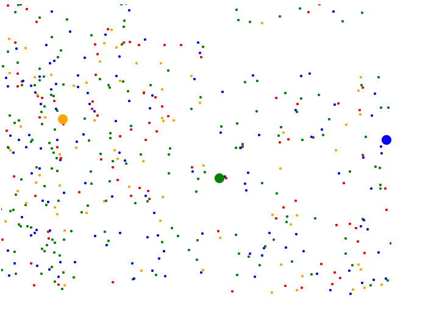
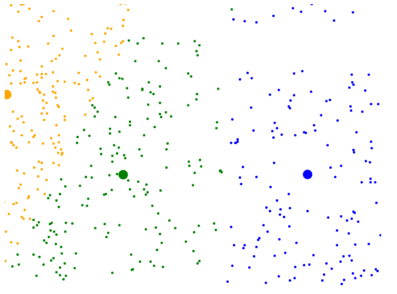

## K-Mean visualization on Javascript

This is a simple clustering algorithm. Starting at seed centroids, loop on this order:

1. Update centroids: 
```
c[1] = (p[1][1] + p[1][2] = p[1][3] + ... + p[1][n]) / length of p[1]

c[2] = (p[2][1] + p[2][2] = p[2][3] + ... + p[2][n]) / length of p[2]

...

c[m] = (p[m][1] + p[m][2] = p[m][3] + ... + p[m][n]) / length of p[m]

```


2. Update lable of points
    Using Euclid between those points to nearest centroids and update label to nearest centroids.

Result:

Original



Labeled


