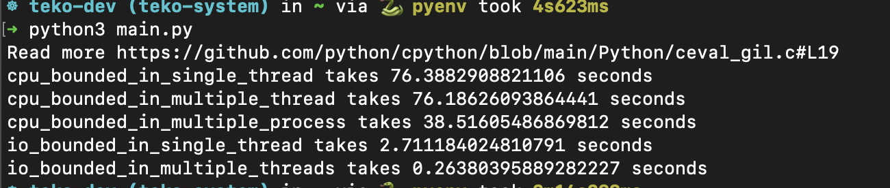
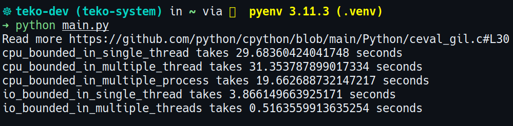

## Single vs Multiple threading vs Multiple Processing in Python

A performance comparation between single threading, multiple threading and multiple processing __in Python__

You can run it:

```bash
$ python main.py
```

And then output

On MacOS



On Linux




I can see that in IO operaion, multiple threading is better than others but CPU operaion, multiple processing is the best solution, of course.

But anomaly is that single thread is faster than multiple thread, why? Because of GIL (Global Interpreter Lock).

One of the reasons for designing GIL to lock all data instead of locking each part is to reduce the number of lock variables (atomic value), avoiding falling into deadlock.
